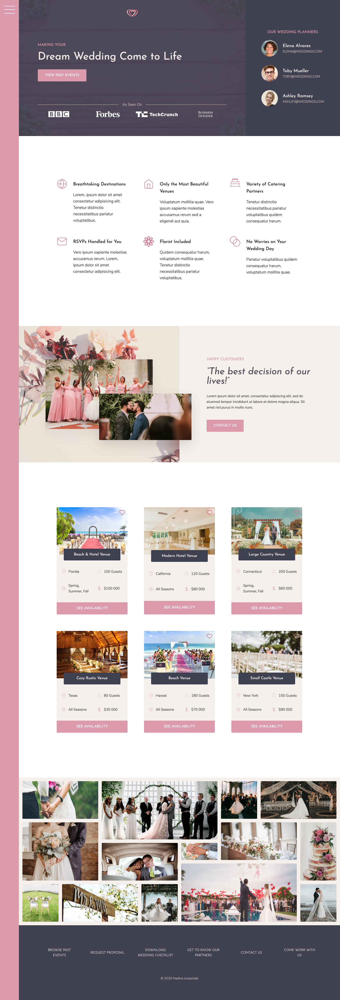
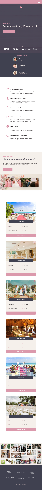
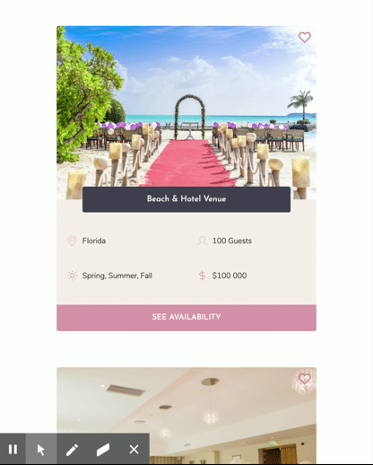

# Wedding Planner Landing Page

Fully responsive landing page for a fictional Wedding Planner agency built with CSS Grid, Flexbox and pure JavaScript.
View the full project [here](https://nadinejuraschek.github.io/Wedding-Planner-Website/).

## Technologies
* Sass
* CSS Grid
* CSS Flexbox
* JavaScript

## Preview
### Desktop

### Mobile

### Like Button

## Images
* [unsplash](https://unsplash.com/)
* [pexels](https://www.pexels.com/)

## Icons
* [FeatherIcons](https://feathericons.com/)
